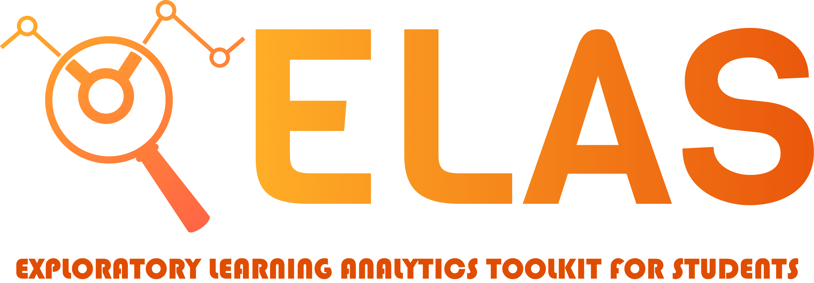

 

The goal of the project "Exploratory Learning Analytics toolkit for Students" is to develop a platform for students of the University of Duisburg-Essen to support learners in learning activities. The platform provides a collection of Learning Analytics applications developed by students for students. The first version of ELAS includes the best projects from the previous iterations of the Learning Analytic (LA), Advanced Web Technologies (AWT), and Learning Analytics and Visual Analytics (LAVA) courses offered at the Social Computing Group, where different Learning Analytics applications were developed as part of student projects.

## 🚀 Get Started

- TODO

#### Live Instances

* Production: [elas-official.soco.inko.cloud](https://elas-official.soco.inko.cloud/) (latest [release](https://github.com/ude-soco/elas-official/releases)) 
* Preview: [edge.elas-official.soco.inko.cloud](https://edge.elas-official.soco.inko.cloud/) ([branch `main`](https://github.com/ude-soco/elas-official/tree/main)) 

#### Build and Run

* `docker compose up`
