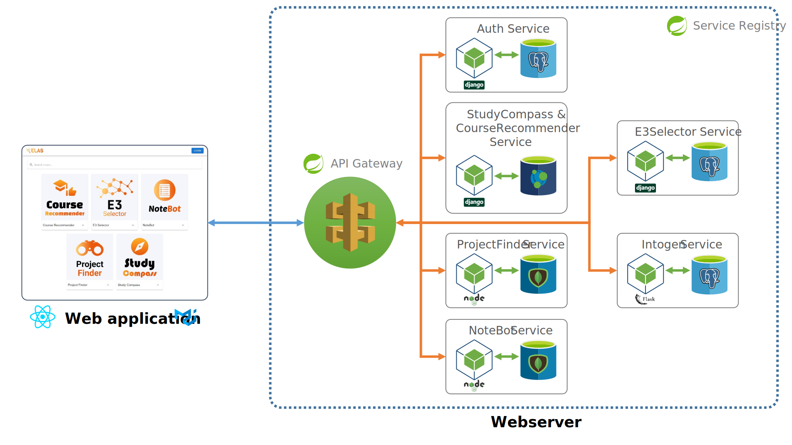

<p align="center"><a href="https://www.uni-due.de/soco/research/projects/elas.php" target="_blank" rel="noopener noreferrer"></a></p><br/>

The goal of the project "Exploratory Learning Analytics toolkit for Students" is to develop a platform for students of the University of Duisburg-Essen to support learners in learning activities. The platform provides a collection of Learning Analytics applications developed by students for students. The first version of ELAS includes the best projects from the previous iterations of the Learning Analytic (LA), Advanced Web Technologies (AWT), and Learning Analytics and Visual Analytics (LAVA) courses offered at the Social Computing Group, where different Learning Analytics applications were developed as part of student projects.

## 🚀 Get Started

- TODO

#### Live Instances

- Production: [elas-official.soco.inko.cloud](https://elas-official.soco.inko.cloud/) (latest [release](https://github.com/ude-soco/elas-official/releases)) 
- Preview: [edge.elas-official.soco.inko.cloud](https://edge.elas-official.soco.inko.cloud/) ([branch `main`](https://github.com/ude-soco/elas-official/tree/main)) 

#### Build and Run

- `docker compose up`

## 🏗️ Technical Architecture

<p align="center"></p><br/>

## 🔨 Development Setup Guide

Download and install the following software

- Java 17. Follow the [guide](https://www.codejava.net/java-se/download-and-install-openjdk-17#:~:text=How%20to%20Download%20and%20Install%20OpenJDK%2017%201,...%202%202.%20Install%20OpenJDK%2017%20on%20Windows) to install Java on Windows.
- Maven. Follow the [guide](https://phoenixnap.com/kb/install-maven-windows) to install Maven on Windows.
- Python (v3.10) from [the official website](https://www.python.org/downloads/release/python-31010/)
- Node.js (v18.12.1) from [the official website](https://nodejs.org/en/blog/release/v18.12.1)
- MongoDB Community Server (v5.0.5) from [the official website](https://www.mongodb.com/try/download/community) and [MongoDB Compass](https://www.mongodb.com/try/download/compass)
- Neo4j Desktop from [the official website](https://neo4j.com/download-center/#desktop), install it, start the server, create database and login to the server.
- Git from [the official website](https://git-scm.com/downloads)
- Github Desktop from [the official website](https://desktop.github.com/)
- [IntelliJ Ultimate](https://www.jetbrains.com/de-de/idea/download/#section=windows) or [Visual Studio Code](https://code.visualstudio.com/download) and install one of the code editors.
- Postman from [the official website](https://www.postman.com/downloads/)

### Installation Guide for Backend Services

#### Step 1: Run Service Register (Spring Boot)

- Using your file explorer, go inside the directory `backend/1-service-registry`.

- Open a command prompt/terminal in the `service-registry` directory with **administration rights**

- Run the following command to package the application into a jar file.

  ```bash
  mvn clean package
  ```

- Run the following command to start the application.

  ```bash
  java -jar target/ServiceRegistry.jar
  ```

#### Step 2: Run API Gateway (Spring Boot)

- Navigate to the `backend/2-api-gateway` directory using your file explorer.

- Open a command prompt/terminal in the `service-registry` directory (with **administration rights** for Windows users)

- Run the following command to package the application into a jar file.

  ```bash
  mvn clean package
  ```

- Run the following command to start the application.

  ```bash
  java -jar target/ApiGateway.jar
  ```

#### Step 3: Run Auth Service (Django)

- Navigate to the `backend/3-auth` directory using your file explorer.

  - Create a new file named `.env` within this directory.
  - Locate the `example.env` file in the same `backend/3-auth` directory and open it.
  - Copy the entire content of the `example.env` file.
  - Now, open the newly created `.env` file and paste the copied content inside.
  - (Optional) Feel free to modify the values of the variables in the `.env` file according to your requirements.

- Open a command prompt/terminal in the `backend/3-auth` directory (with **administration rights** for Windows users)

- Set up a Python virtual environment on Windows, follow these steps:

  1. Install `pipenv` (only once)

     ```bash
     pip install pipenv
     ```

  2. Install required packages (only once)

     ```bash
     pipenv install
     ```

  3. Activate the virtual environment (every time when you want to start the server)

     ```bash
     pipenv shell
     ```

  **(Optional)** To check the location of your Python virtual environment, type the following command in your command prompt

  ```bash
  pipenv --venv
  ```

- Before running the Django server, ensure that your database is up to date. Run the following commands to perform migrations

  1. Create migrations (only once)

     ```bash
     python manage.py makemigrations
     ```

  2. Apply migrations

     ```bash
     python manage.py migrate
     ```

  Note: Delete the db.sqlite3 file if it exists; it will be recreated after successful migrations. Run migrations only when you've made changes to the relational database models.

- Run the Django server

  ```bash
    python manage.py runserver
  ```

  By following these steps, your Python virtual environment will be set up, the database will be migrated, and the Django server will be running and ready for development.

#### Step 4: Run E3Selector Service (Django)

- Navigate to the `backend/4-e3selector` directory using your file explorer.

  - Create a new file named `.env` within this directory.
  - Locate the `example.env` file in the same `backend/4-e3selector` directory and open it.
  - Copy the entire content of the `example.env` file.
  - Now, open the newly created `.env` file and paste the copied content inside.
  - (Optional) Feel free to modify the values of the variables in the `.env` file according to your requirements.

- Open a command prompt/terminal in the `backend/4-e3selector` directory (with **administration rights** for Windows users)

- Set up a Python virtual environment on Windows, follow these steps:

  1. Install `pipenv` (only once)

     ```bash
     pip install pipenv
     ```

  2. Install required packages (only once)

     ```bash
     pipenv install
     ```

  3. Activate the virtual environment (every time when you want to start the server)

     ```bash
     pipenv shell
     ```

  **(Optional)** To check the location of your Python virtual environment, type the following command in your command prompt

  ```bash
  pipenv --venv
  ```

- Before running the Django server, ensure that your database is up to date. Run the following commands to perform migrations

  1. Create migrations (only once)

     ```bash
     python manage.py makemigrations
     ```

  2. Apply migrations

     ```bash
     python manage.py migrate
     ```

  Note: Delete the db.sqlite3 file if it exists; it will be recreated after successful migrations. Run migrations only when you've made changes to the relational database models.

- Run the Django server

  ```bash
    python manage.py runserver
  ```

  By following these steps, your Python virtual environment will be set up, the database will be migrated, and the Django server will be running and ready for development.

- Run the `celery` worker command in a separate terminal if you are using Linux or Windows with at least more than 4 cores

  ```bash
  celery -A server worker --concurrency=4 -l info -P eventlet
  ```

  Use the following command to run the celery worker if you are using Windows with less than 4 cores:

  ```bash
  celery -A server worker -l info -P eventlet
  ```

- (Optional) Run `flower` to monitor the celery worker

  ```bash
    flower -A server --port=5555
  ```

#### Step 5: Run StudyCompass & CourseRecommender Service (Django)

- Navigate to the `backend/5-studycompass` directory using your file explorer.

  - Create a new file named `.env` within this directory.
  - Locate the `example.env` file in the same `backend/5-studycompass` directory and open it.
  - Copy the entire content of the `example.env` file.
  - Now, open the newly created `.env` file and paste the copied content inside.
  - (Optional) Feel free to modify the values of the variables in the `.env` file according to your requirements.

- Open a command prompt/terminal in the `backend/5-studycompass` directory (with **administration rights** for Windows users)

- Set up a Python virtual environment on Windows, follow these steps:

  1. Install `pipenv` (only once)

     ```bash
     pip install pipenv
     ```

  2. Install required packages (only once)

     ```bash
     pipenv install
     ```

  3. Activate the virtual environment (every time when you want to start the server)

     ```bash
     pipenv shell
     ```

  **(Optional)** To check the location of your Python virtual environment, type the following command in your command prompt

  ```bash
  pipenv --venv
  ```

- Before running the Django server, ensure that your database is up to date. Run the following commands to perform migrations

  1. Create migrations (only once)

     ```bash
     python manage.py makemigrations
     ```

  2. Apply migrations

     ```bash
     python manage.py migrate
     ```

  Note: Delete the db.sqlite3 file if it exists; it will be recreated after successful migrations. Run migrations only when you've made changes to the relational database models.

- Run the Django server

  ```bash
    python manage.py runserver
  ```

  By following these steps, your Python virtual environment will be set up, the database will be migrated, and the Django server will be running and ready for development.

- Run the `celery` worker command in a separate command prompt/terminal if you are using Linux with at least more than 4 cores

  ```bash
  celery -A server worker --concurrency=4 -l info -P eventlet
  ```

  Use the following command to run the celery worker if you are using Windows:

  ```bash
  celery -A server worker -l info -P eventlet
  ```

- (Optional) Run `flower` to monitor the celery worker

  ```bash
  flower -A server --port=5555
  ```

#### Step 6: Run ProjectFinder (TBA)

- TODO

#### Step 7: Run NoteBot (Node.JS)

- Navigate to the `backend/7-notebot` directory using your file explorer.

  - Create a new file named `.env` within this directory.
  - Locate the `example.env` file in the same `backend/7-notebot` directory and open it.
  - Copy the entire content of the `example.env` file.
  - Now, open the newly created `.env` file and paste the copied content inside.
  - (Optional) Feel free to modify the values of the variables in the `.env` file according to your requirements.

- Open a command prompt/terminal in the `backend/7-notebot` directory (with **administration rights** for Windows users)

- To install Node packages, enter the following command in your command prompt or terminal:

  ```bash
  npm ci
  ```

  In case you encounter issues with the npm ci command, you can try either of the following commands:

  ```bash
  npm install
  ```

  OR

  ```bash
  npm install --force
  ```

  Please exercise caution with `npm install` and `npm install --force` as they will delete existing node packages, install new ones, and update the `package-lock.json` file. Be careful not to push changes to the `package-lock.json` file.

- After successfully installing the packages, use the following command to start the server:

  ```bash
  npm run watch:dev
  ```

- To stop the server, simply press `Ctrl + C` inside the command prompt/terminal.

### Installation Guide for Frontend Service

- Navigate to the `frontend` directory using your file explorer.

  - Create a new file named `.env` within this directory.
  - Locate the `example.env` file in the same `frontend` directory and open it.
  - Copy the entire content of the `example.env` file.
  - Now, open the newly created `.env` file and paste the copied content inside.
  - (Optional) Feel free to modify the values of the variables in the `.env` file according to your requirements.

- Open a command prompt/terminal in the `frontend` directory (with **administration rights** for Windows users)

- To install Node packages, enter the following command in your command prompt or terminal:

  ```bash
  npm ci
  ```

  In case you encounter issues with the npm ci command, you can try either of the following commands:

  ```bash
  npm install
  ```

  OR

  ```bash
  npm install --force
  ```

  Please exercise caution with `npm install` and `npm install --force` as they will delete existing node packages, install new ones, and update the `package-lock.json` file. Be careful not to push changes to the `package-lock.json` file.

- After successfully installing the packages, use the following command to start the server:

  ```bash
  npm start
  ```

- The server will run at [http://localhost:8080](http://localhost:8080)

- To stop the server, simply press `Ctrl + C` inside the command prompt/terminal.
