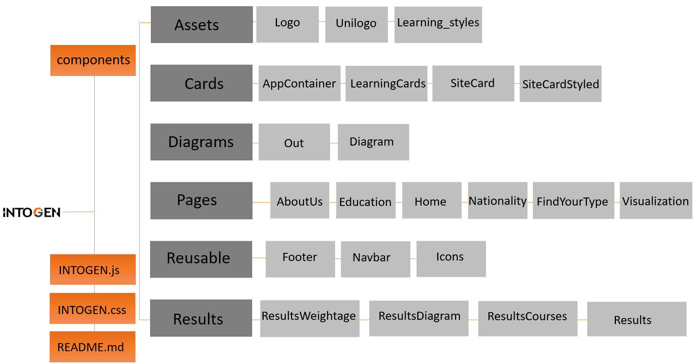
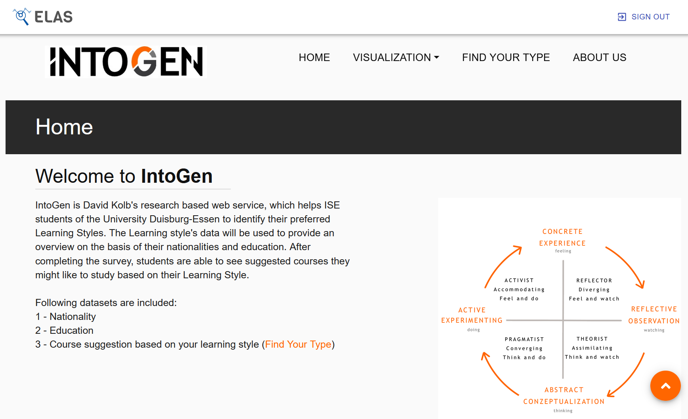
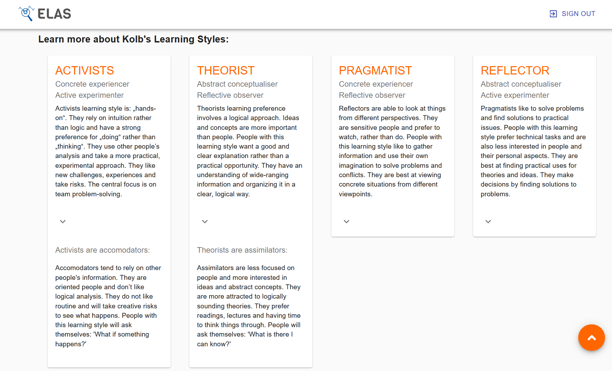
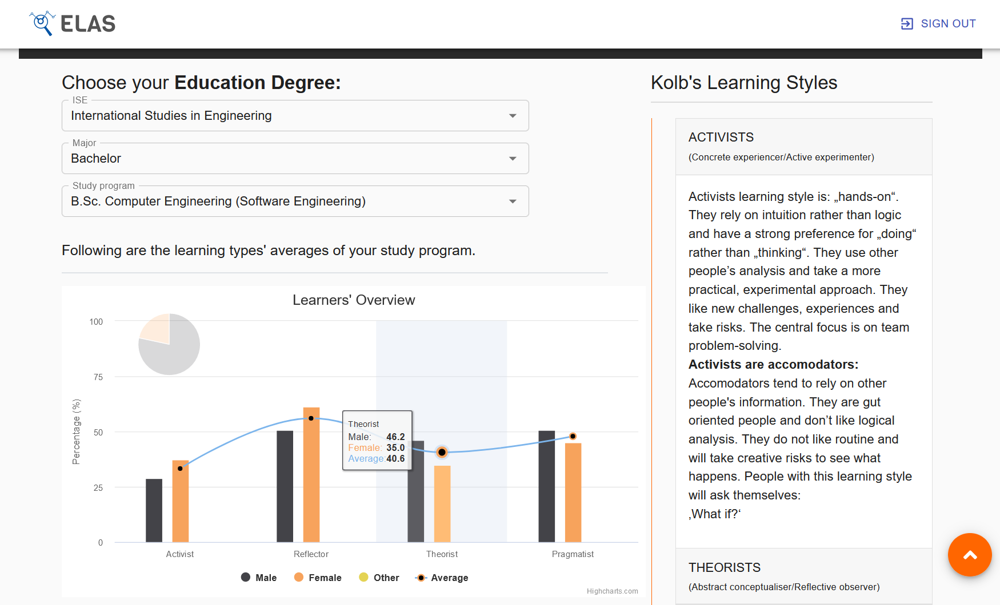
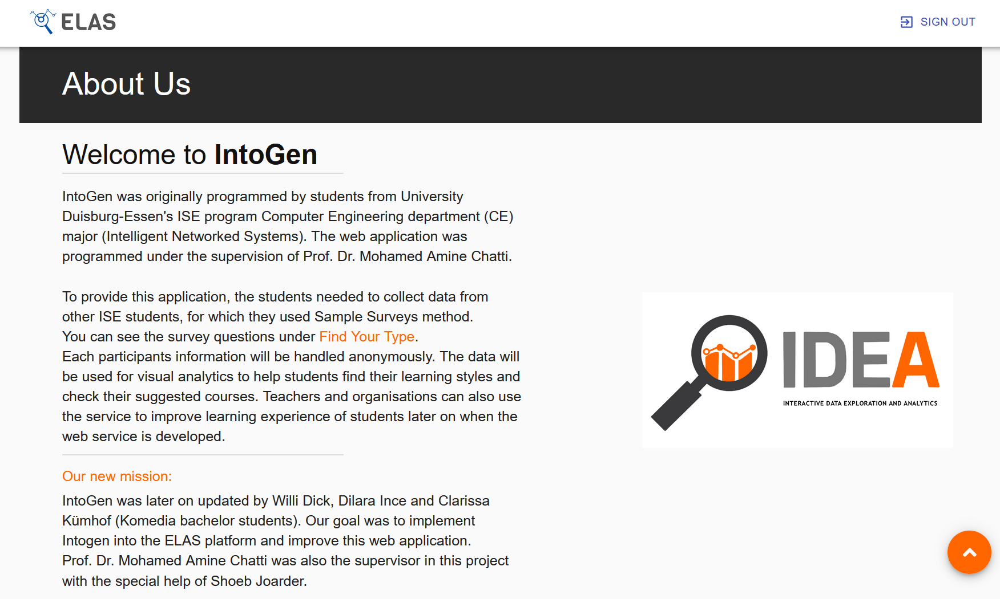
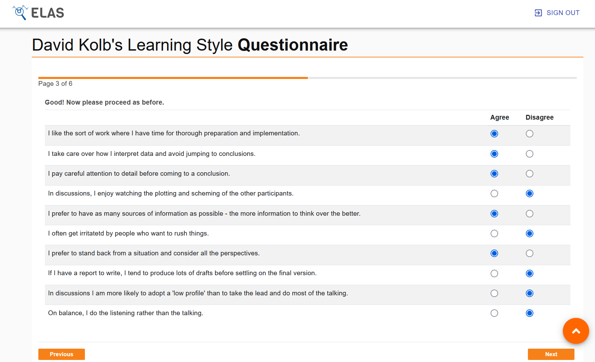
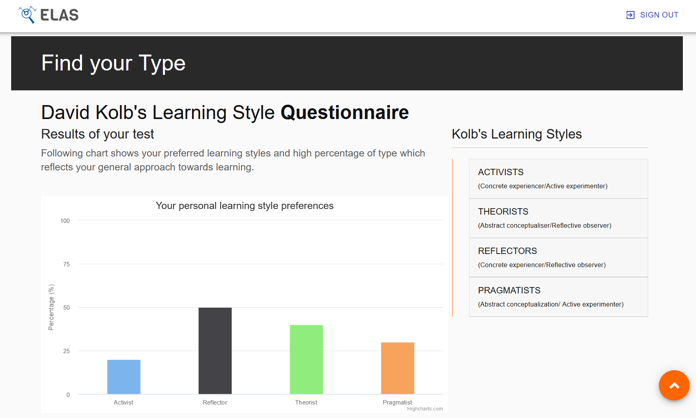
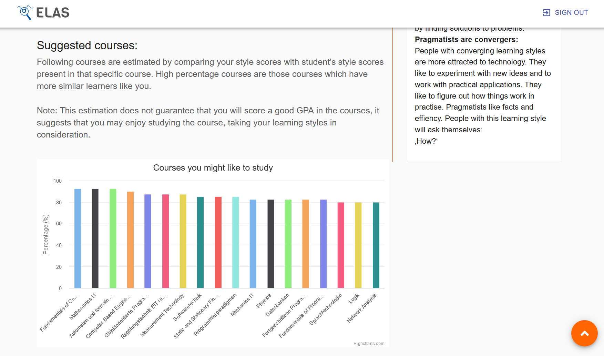

<p align="center">
 </br>
<b height="40px" >Never study false again – Your Guide to Your Learning Type</b>
</p>

## Table of Contents

* [Project Information](#project-information)
* [Project Architecture](#project-architecture)
* [Libraries used](#libraries-used)
* [Visualization](#visualization)
* [Links](#links)
* [Get Started](#get-started)
* [Developers](#developers)

## Project Information

IntoGen is a web service for ISE students of the University Duisburg-Essen to find out their personal learning type based on David Kolb's research.

It is designed to help students
- find their individual learning types with a 40-item questionnaire
- find courses that are suitable for their learning type
- get an overview of the learning types present in other courses, study programs and countries


## Project Architecture


## Libraries used
- [Material UI](https://material-ui.com) (e.g. Autocomplete, Accordion)
- [SurveyJS](https://surveyjs.io)
- [Highcharts](https://www.highcharts.com)

## Visualization








## Links
<a href="https://www.youtube.com/watch?v=HBahnBGqnn4">Advertisement Video</a></br>
<a href="https://www.youtube.com/watch?v=xgwdKz1TzuY">Demo</a>

## Get Started

You can also follow the instructions in the [ELAS README.md](https://github.com/ude-soco/ELAS) file. If you follow the steps there, it will also navigate you to the IntoGen page. 

#### Backend Installation
- Make sure you have downloaded and installed [Python](https://www.python.org/downloads/release/python-387/)
- Make sure you have downloaded and installed [MongoDB Community Server](https://www.mongodb.com/try/download/community)
- Open a comand prompt/ terminal, move inside `backend` folder, and follow the steps below:

    - Install a python virtual environment
    ```sh
    python -m venv venv
    ``` 
    - Activate the python virtual environment
    ```sh
    .\venv\Scripts\activate
    ``` 
    - Upgrade the pip version
    ```sh
    python -m pip install --upgrade pip
    ```
    - Install the required packages from the `requirements.txt` file 
    ```sh
    pip install -r requirements.txt 
    ```
- Rename the files `example.env` to `.env` and `example.flaskenv` to `.flaskenv` 
- Type the following command in a command prompt/ terminal to run the server
```sh
python -m flask run
```

#### Frontend Installation
- Download and install [NodeJS](https://nodejs.org/en/)
- Move to `frontend` folder and rename the file `example.env` to `.env` 
- Open command prompt/ terminal and follow the steps below:

    - Make sure you have downloaded and installed node packages
    ```sh
    npm install
    ``` 
    - Run the script and start the application
    ```sh
    npm start
    ``` 
- Application will start automatically in [http://localhost:3000](http://localhost:3000). Use the application with the zoom factor 90%

## Developers
Komedia students in the 4th and 6th semester: </br>
- Dilara Ince </br>
- Clarissa Kümhof </br>
- Willi Dick